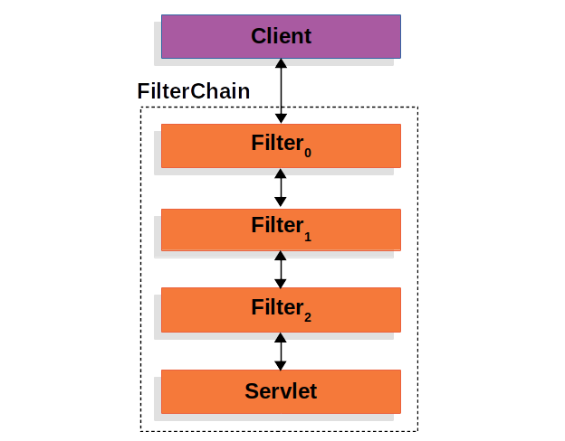
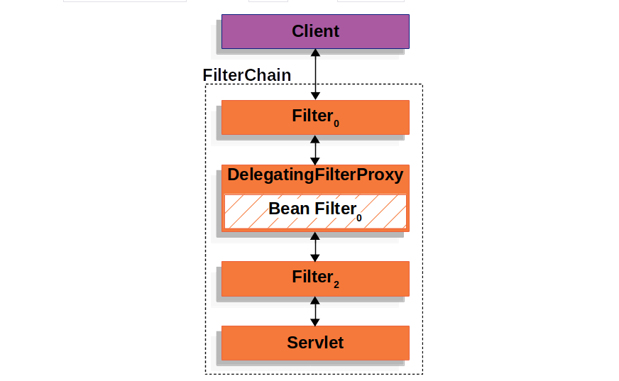
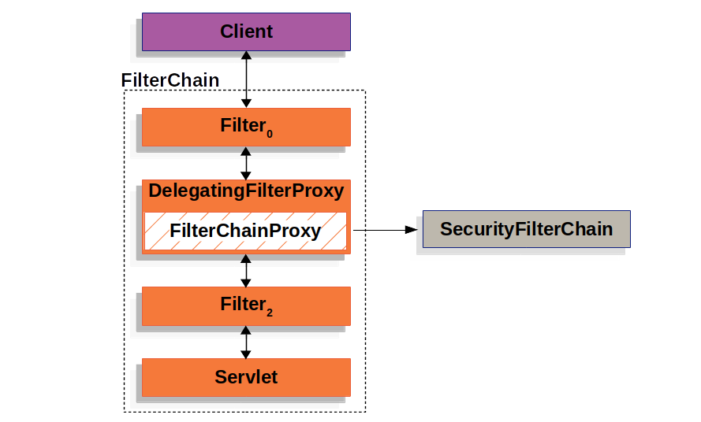
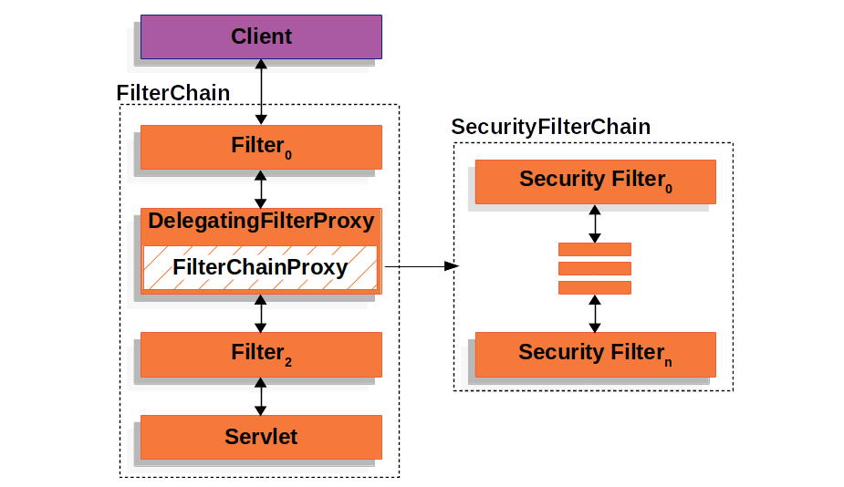
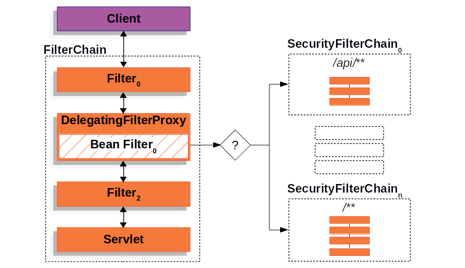
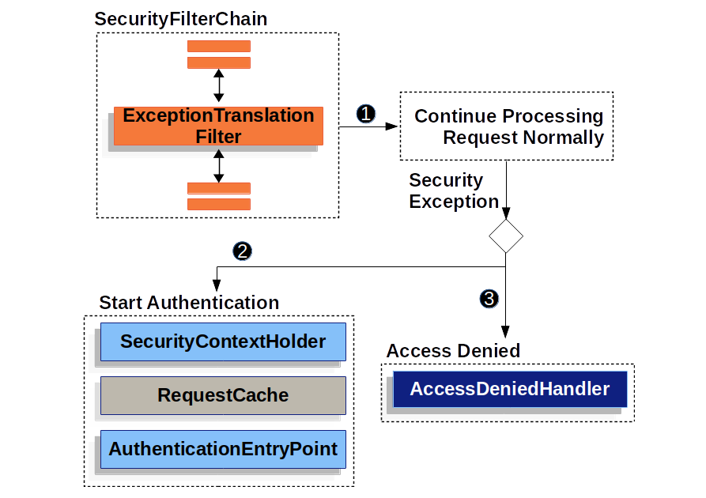

# 架构
Spring Security 在基于 Servlet 的应用程序中的高层架构。
我们将在参考文献中的 "身份验证"、"授权 "和 "防止漏洞利用 "等章节中加深对高层架构的理解。
# 回顾过滤器
Spring Security 的 Servlet 支持是基于 Servlet 过滤器的，因此有必要先了解一下过滤器的作用。下图显示了单个 HTTP 请求处理程序的典型分层。



客户端向应用程序发送请求，容器会创建一个过滤器链`FilterChain`，
其中包含根据请求 URI 的路径处理 HttpServletRequest 的过滤器和 Servlet。
在 Spring MVC 应用程序中，Servlet 是 `DispatcherServlet` 的实例。
一个 Servlet 最多只能处理一个 `HttpServletRequest` 和 `HttpServletResponse`。
不过，可以使用多个过滤器：

- 防止下游过滤器或 Servlet 被调用。在这种情况下，过滤器通常会写入 HttpServletResponse
- 修改下游过滤器和 Servlet 使用的 HttpServletRequest 或 HttpServletResponse

FilterChain Usage Example:

```java
public void doFilter(ServletRequest request, ServletResponse response, FilterChain chain) {
    // do something before the rest of the application
    chain.doFilter(request, response); // invoke the rest of the application
    // do something after the rest of the application
}
```

由于过滤器只影响下游过滤器和 Servlet，因此调用每个过滤器的顺序极为重要。

# DelegatingFilterProxy

Spring 提供了一种名为 `DelegatingFilterProxy` 的过滤器实现，
可在 Servlet 容器的生命周期和 `Spring` 的 `ApplicationContext` 之间架起桥梁。
Servlet 容器允许使用自己的标准注册过滤器，但它并不了解 Spring 定义的 Bean。
`DelegatingFilterProxy` 可以注册到 Servlet 容器中，
但会将所有工作委托给实现 Filter 的 Spring Bean。

下面的图片展示了 DelegatingFilterProxy 如何融入过滤器和过滤器链。



`DelegatingFilterProxy` 从 `ApplicationContext` 中查找 `Bean Filter0`，
然后调用 `Bean Filter0`。DelegatingFilterProxy 的伪代码如下所示:

```java
public void doFilter(ServletRequest request, ServletResponse response, FilterChain chain) {
	// Lazily get Filter that was registered as a Spring Bean
	// For the example in DelegatingFilterProxy delegate is an instance of Bean Filter0
	Filter delegate = getFilterBean(someBeanName);
	// delegate work to the Spring Bean
	delegate.doFilter(request, response);
}
```

`DelegatingFilterProxy` 的另一个好处是它允许延迟查找过滤器 Bean 实例。
这一点很重要，因为容器需要在启动之前注册过滤器实例。
然而，Spring 通常会使用 `ContextLoaderListener` 来加载 Spring Beans，
这要等到需要注册过滤器实例之后才能完成。

# FilterChainProxy
Spring Security 的 Servlet 包含在 `FilterChainProxy` 中。
`FilterChainProxy` 是 Spring Security 提供的一种特殊过滤器，
允许通过 `SecurityFilterChain` 委托多个过滤器实例。
由于 `FilterChainProxy` 是一个 Bean，它通常被封装在 `DelegatingFilterProxy` 中。



# SecurityFilterChain
`SecurityFilterChain` 由 FilterChainProxy 使用，以确定该请求应调用哪些 Spring 安全过滤器。



`SecurityFilterChain` 中的安全过滤器通常是 Bean，
但它们是通过 `FilterChainProxy` 而不是 `DelegatingFilterProxy` 注册的。
与直接向 `Servlet` 容器或 `DelegatingFilterProxy` 注册相比，
`FilterChainProxy` 有很多优点。首先，它为 Spring Security 的所有 Servlet 支持提供了一个起点。
因此，如果你想对 Spring Security 的 Servlet 支持进行异常排除，在 FilterChainProxy 中添加调试点是一个很好的起点。

其次，由于 `FilterChainProxy` 是 Spring Security 使用的核心，
因此它可以执行一些不被视为可选的任务。例如，它会清除 SecurityContext 以避免内存泄漏。
它还可以应用 Spring Security 的 `HttpFirewall` 来保护应用程序免受某些类型的攻击。

此外，它还能更灵活地确定何时调用 `SecurityFilterChain`。
在 Servlet 容器中，过滤器仅根据 URL 调用。但是，`FilterChainProxy` 可以通过利用 `RequestMatcher` 接口，
根据 HttpServletRequest 中的任何内容来确定调用。

事实上，`FilterChainProxy` 可用于确定应使用哪个 `SecurityFilterChain`。
这样就可以为应用程序的不同片段提供完全独立的配置。


在多个 `SecurityFilterChain` 图中，`FilterChainProxy` 决定应使用哪个 `SecurityFilterChain`。
只有第一个匹配的 `SecurityFilterChain` 才会被调用。如果请求的 URL 是 `/api/messages/`，
它将首先与 `SecurityFilterChain0` 的 /api/** 模式匹配，因此只调用 `SecurityFilterChain0`，
即使它也与 `SecurityFilterChainn` 匹配。如果请求的 URL 为 `/messages/`，
则与 `SecurityFilterChain0` 的 `/api/**` 模式不匹配，因此 `FilterChainProxy` 将继续尝试每个 `SecurityFilterChain`。
如果没有其他安全过滤链实例与安全过滤链相匹配，则将调用安全过滤链。

请注意，SecurityFilterChain0 只配置了三个安全过滤器实例。
但是，SecurityFilterChainn 配置了四个安全过滤器。
值得注意的是，每个 SecurityFilterChain 都可以是唯一的，并可以单独配置。
事实上，如果应用程序希望 Spring Security 忽略某些请求，SecurityFilterChain 的安全过滤器可能为零。

# 安全过滤器
安全过滤器是通过 SecurityFilterChain API 插入 FilterChainProxy 的。
过滤器的顺序很重要。通常没有必要知道 Spring Security 过滤器的顺序。不过，有时知道排序会有好处

以下是 Spring Security 过滤器顺序列表：
- ForceEagerSessionCreationFilter
- ChannelProcessingFilter
- WebAsyncManagerIntegrationFilter
- SecurityContextPersistenceFilter
- HeaderWriterFilter
- CorsFilter
- CsrfFilter
- LogoutFilter
- OAuth2AuthorizationRequestRedirectFilter
- Saml2WebSsoAuthenticationRequestFilter
- X509AuthenticationFilter
- AbstractPreAuthenticatedProcessingFilter
- CasAuthenticationFilter
- OAuth2LoginAuthenticationFilter
- Saml2WebSsoAuthenticationFilter
- UsernamePasswordAuthenticationFilter
- OpenIDAuthenticationFilter
- DefaultLoginPageGeneratingFilter
- DefaultLogoutPageGeneratingFilter
- ConcurrentSessionFilter
- DigestAuthenticationFilter
- BearerTokenAuthenticationFilter
- BasicAuthenticationFilter
- RequestCacheAwareFilter
- SecurityContextHolderAwareRequestFilter
- JaasApiIntegrationFilter
- RememberMeAuthenticationFilter
- AnonymousAuthenticationFilter
- OAuth2AuthorizationCodeGrantFilter
- SessionManagementFilter
- ExceptionTranslationFilter
- FilterSecurityInterceptor
- SwitchUserFilter

# 处理安全异常
`ExceptionTranslationFilter` 可将 `AccessDeniedException` 和 `AuthenticationException` 转换为 HTTP 响应。

`ExceptionTranslationFilter` 作为安全过滤器之一插入到过滤器链代理中。



1. 首先，`ExceptionTranslationFilter` 调用 `FilterChain.doFilter(request, response)` 来调用应用程序的其他部分。
2. 如果用户未通过身份验证或出现身份验证异常，则启动身份验证。
   - SecurityContextHolder 已被清空
   - `HttpServletRequest` 保存在 `RequestCache` 中。当用户成功通过身份验证后，`RequestCache` 将用于重放原始请求。
   - `AuthenticationEntryPoint` 用于向客户端请求凭证。例如，它可以重定向到登录页面或发送 WWW-Authenticate 头信息。
3. 否则，如果是 `AccessDeniedException`，则表示拒绝访问。调用 `AccessDeniedHandler` 来处理拒绝访问。

`ExceptionTranslationFilter` 的伪代码如下：
```java
try {
    filterChain.doFilter(request, response); 
} catch (AccessDeniedException | AuthenticationException ex) {
    if (!authenticated || ex instanceof AuthenticationException) {
        startAuthentication();
    } else {
        accessDenied();
    }
}
```
1. 在过滤器回顾章节中，调用 `FilterChain.doFilter(request, response)` 相当于调用应用程序的其他部分。
这意味着，如果应用程序的其他部分（即 FilterSecurityInterceptor 或方法安全性）抛出 AuthenticationException 或 AccessDeniedException，将在此处捕获并处理。
2. 如果用户未通过身份验证或出现身份验证异常，则启动身份验证
3. 否则，拒绝访问