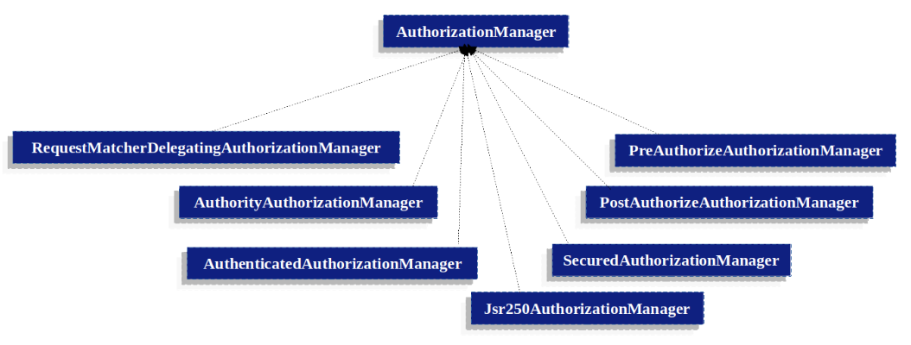

# 授权架构

## Authorities

`Authentication`，讨论所有`Authentication`实现如何存储 `GrantedAuthority` 对象列表。这些对象代表已授予委托人的权限。
`GrantedAuthority`由 `AuthenticationManager` 插入到 `Authentication` 对象中，
随后由 `AuthorizationManager` 在做出授权决定时读取。

`GrantedAuthority` 是一个只有一个方法的接口：

```java
String getAuthority();
```

通过该方法，`AuthorizationManagers` 可以获得 `GrantedAuthority` 的精确字符串表示。
通过返回字符串表示法，大多数`AuthorizationManager`和`AccessDecisionManager`都能轻松 "读取" `GrantedAuthority`。
如果`GrantedAuthority` 不能精确地用字符串表示，则该`GrantedAuthority` 将被视为 "复杂 "权限，
`getAuthority()` 必须返回空值。

一个 "复杂" `GrantantedAuthority` 的例子是存储适用于不同客户账号的操作和权限阈值列表。
用字符串来表示这种复杂的`GrantedAuthority` 是相当困难的，因此 `getAuthority()` 方法应返回空值。
这将向任何`AuthorizationManager` 表明，它需要专门支持 `GrantedAuthority` 实现才能理解其内容。

Spring Security 包含一个具体的 `GrantedAuthority` 实现，即 `SimpleGrantedAuthority`。
它允许将任何用户指定的字符串转换为 `GrantedAuthority`。
安全架构中包含的所有 `AuthenticationProviders` 都使用 `SimpleGrantedAuthority` 来填充 `Authentication` 对象。

## 调用前处理

Spring Security 提供的拦截器可控制对安全对象（如方法调用或网络请求）的访问。
访问决定管理器`AccessDecisionManager`会在调用前决定是否允许继续调用。

### AuthorizationManager

`AuthorizationManager` 取代了 `AccessDecisionManager` 和 `AccessDecisionVoter`。

我们鼓励定制 `AccessDecisionManager` 或 `AccessDecisionVoter` 的应用程序改用 `AuthorizationManager`。

`AuthorizationManager` 由 `AuthorizationFilter` 调用，负责做出最终的访问控制决定。
`AuthorizationManager` 接口包含两个方法：

```java
AuthorizationDecision check(Supplier<Authentication> authentication, Object secureObject);

default AuthorizationDecision verify(Supplier<Authentication> authentication, Object secureObject)
        throws AccessDeniedException {
    // ...
}
```

`AuthorizationManager`的检查方法会传递所有相关信息，以便做出授权决定。
特别是，通过安全对象，可以检查实际安全对象调用中包含的参数。
例如，假设安全对象是一个方法调用 `MethodInvocation`。
我们可以很容易地查询 `MethodInvocation` 中的任何客户参数，然后在 `AuthorizationManager` 中实现某种安全逻辑，
以确保委托人获准对该客户进行操作。如果允许访问，则实现过程应返回正的 `AuthorizationDecision`；
如果拒绝访问，则返回负的 `AuthorizationDecision`；
如果放弃决策，则返回空的 `AuthorizationDecision`。

如果出现负的`AuthorizationDecision`，verify 将调用检查并随后抛出 `AccessDeniedException`。

### 基于委托的 AuthorizationManager 实现

用户可以实现自己的授权管理器`AuthorizationManager`来控制授权的各个方面，
而 Spring Security 则提供了一个授权管理器`AuthorizationManager`，它可以与各个`AuthorizationManager`协作。

`RequestMatcherDelegatingAuthorizationManager` 会将请求与最合适的委托 `AuthorizationManager` 匹配。
对于方法安全，可以使用 `AuthorizationManagerBeforeMethodInterceptor` 和 `AuthorizationManagerAfterMethodInterceptor`。

授权管理器实现说明了相关类。



使用这种方法，可以就授权决定轮询 `AuthorizationManager` 实现的组合。

### AuthorityAuthorizationManager

Spring Security 提供的最常见 `AuthorizationManager` 是 `AuthorityAuthorizationManager`。
该授权管理器根据给定的授权集进行配置，以便在当前`Authentication`中查找授权。
如果`Authentication`包含任何已配置的授权，它将返回肯定的 `AuthorizationDecision`。
否则，它将返回否定的 `AuthorizationDecision`。

### AuthenticatedAuthorizationManager

另一个管理器是 `AuthenticatedAuthorizationManager`。
它可用于区分匿名用户、完全身份验证用户和记住我身份验证用户。
许多网站允许使用记住我身份验证进行某些有限的访问，但要求用户通过登录来确认身份，以获得完全访问权。

### 自定义授权管理器

显然，您也可以实现一个自定义的 `AuthorizationManager`，并在其中加入您想要的任何访问控制逻辑。
它可能是针对你的应用程序的（与业务逻辑相关），也可能实现一些安全管理逻辑。
例如，你可以创建一个可以查询 Open Policy Agent 或你自己的授权数据库的实现。

## 调整 AccessDecisionManager 和 AccessDecisionVoters

在 `AuthorizationManager` 之前，Spring Security 发布了 `AccessDecisionManager` 和 `AccessDecisionVoter`。

在某些情况下，例如迁移旧版应用程序，可能需要引入一个能调用 `AccessDecisionManager` 或 `AccessDecisionVoter` 的 `AuthorizationManager`。

要调用现有的 `AccessDecisionManager`，可以通过以下方法：

```java
@Component
public class AccessDecisionManagerAuthorizationManagerAdapter implements AuthorizationManager {
    private final AccessDecisionManager accessDecisionManager;
    private final SecurityMetadataSource securityMetadataSource;

    @Override
    public AuthorizationDecision check(Supplier<Authentication> authentication, Object object) {
        try {
            Collection<ConfigAttributes> attributes = this.securityMetadataSource.getAttributes(object);
            this.accessDecisionManager.decide(authentication.get(), object, attributes);
            return new AuthorizationDecision(true);
        } catch (AccessDeniedException ex) {
            return new AuthorizationDecision(false);
        }
    }

    @Override
    public void verify(Supplier<Authentication> authentication, Object object) {
        Collection<ConfigAttributes> attributes = this.securityMetadataSource.getAttributes(object);
        this.accessDecisionManager.decide(authentication.get(), object, attributes);
    }
}
```

然后将其连接到 `SecurityFilterChain` 中。

或者只调用 `AccessDecisionVoter`，也可以这样做：

```java
@Component
public class AccessDecisionVoterAuthorizationManagerAdapter implements AuthorizationManager {
    private final AccessDecisionVoter accessDecisionVoter;
    private final SecurityMetadataSource securityMetadataSource;

    @Override
    public AuthorizationDecision check(Supplier<Authentication> authentication, Object object) {
        Collection<ConfigAttributes> attributes = this.securityMetadataSource.getAttributes(object);
        int decision = this.accessDecisionVoter.vote(authentication.get(), object, attributes);
        switch (decision) {
        case ACCESS_GRANTED:
            return new AuthorizationDecision(true);
        case ACCESS_DENIED:
            return new AuthorizationDecision(false);
        }
        return null;
    }
}
```

然后将其连接到 SecurityFilterChain 中。

## 分层角色

应用程序中的某个特定角色应自动 "包括 "其他角色，这是一种常见的要求。
例如，在一个有 "管理员 "和 "用户 "角色概念的应用程序中，你可能希望管理员能做普通用户能做的所有事情。
要做到这一点，可以确保所有管理员用户也被分配了 "用户 "角色。
或者，也可以修改所有需要 "用户 "角色的访问限制，使其也包括 "管理员 "角色。
如果应用程序中有很多不同的角色，这可能会变得相当复杂。

使用角色层次结构可以配置哪些角色（或权限）应包括其他角色。
Spring Security 的 `RoleVoter` 的扩展版本 `RoleHierarchyVoter` 与 `RoleHierarchy` 一起配置，
并从中获取分配给用户的所有 "可达权限"。典型的配置如下:

```java
@Bean
AccessDecisionVoter hierarchyVoter() {
    RoleHierarchy hierarchy = new RoleHierarchyImpl();
    hierarchy.setHierarchy("ROLE_ADMIN > ROLE_STAFF\n" +
            "ROLE_STAFF > ROLE_USER\n" +
            "ROLE_USER > ROLE_GUEST");
    return new RoleHierarchyVoter(hierarchy);
}
```

在这里，我们在一个层次结构中有四个角色：`ROLE_ADMIN ⇒ ROLE_STAFF ⇒ ROLE_USER ⇒ ROLE_GUEST`。
通过 `ROLE_ADMIN` 身份验证的用户，在根据调用上述 `RoleHierarchyVoter` 的授权管理器（`AuthorizationManager`）对安全约束进行评估时，
将表现为拥有所有四种角色。符号 `>`可以理解为 "包括 "的意思。

角色分层为简化应用程序的访问控制配置数据和/或减少分配给用户的权限数量提供了方便。
对于更复杂的需求，你可能希望在应用程序所需的特定访问权限和分配给用户的角色之间定义一个逻辑映射，
并在加载用户信息时在两者之间进行转换。


