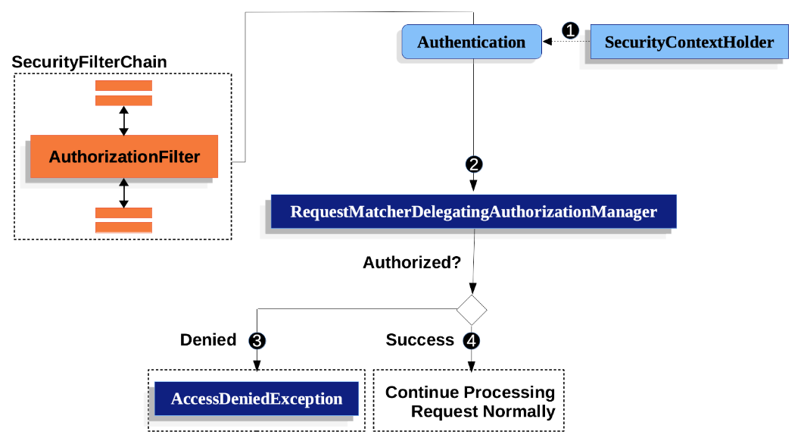

# 使用 AuthorizationFilter 授权 HttpServletRequests

本节以 Servlet 架构与实现为基础，深入探讨授权如何在基于 Servlet 的应用程序中发挥作用。

> AuthorizationFilter 取代了 FilterSecurityInterceptor。
>为了保持向后兼容，FilterSecurityInterceptor 仍是默认配置。
>本节将讨论 AuthorizationFilter 的工作原理以及如何覆盖默认配置。

授权过滤器（`AuthorizationFilter`）为 `HttpServletRequests` 提供授权。
它作为安全过滤器之一插入到 `FilterChainProxy` 中。

在声明 `SecurityFilterChain` 时，可以覆盖默认值。与其使用 `authorizeRequests`，不如使用 `authorizeHttpRequests`，如下所示：

```java
@Bean
SecurityFilterChain web(HttpSecurity http) throws AuthenticationException {
    http
        .authorizeHttpRequests((authorize) -> authorize
            .anyRequest().authenticated();
        )
        // ...

    return http.build();
}
```

这在很多方面改进了 authorizeRequests：
1. 使用简化的 `AuthorizationManager` API，而不是元数据源、配置属性、决策管理器和投票人。这简化了重用和定制。
2. 延迟`Authentication`查询。不再需要对每个请求都进行 `Authentication` 查询，而是只在授权决定需要身份验证的请求中进行查询。
3. 支持基于 Bean 的配置。

当使用 `authorizeHttpRequests` 而不是 `authorizeRequests` 时，则使用 `AuthorizationFilter` 而不是 `FilterSecurityInterceptor`。



1. 首先，`AuthorizationFilter` 从 `SecurityContextHolder` 获取一个 `Authentication`。为了延迟查询，它会将其封装在一个 `Supplier` 中。
2. 其次，它将 `Supplier<Authentication>` 和 `HttpServletRequest` 传递给 `AuthorizationManager`。
    - 如果拒绝授权，就会抛出 `AccessDeniedException`。在这种情况下，`ExceptionTranslationFilter` 会处理 `AccessDeniedException`。
    - 如果访问获准，`AuthorizationFilter` 会继续执行 `FilterChain`，允许应用程序正常处理。
    
我们可以通过按优先级顺序添加更多规则来配置 Spring Security 的不同规则。

```java
@Bean
SecurityFilterChain web(HttpSecurity http) throws Exception {
	http
		// ...
		.authorizeHttpRequests(authorize -> authorize                                  
			.mvcMatchers("/resources/**", "/signup", "/about").permitAll()         
			.mvcMatchers("/admin/**").hasRole("ADMIN")                             
			.mvcMatchers("/db/**").access((authentication, request) ->
			    Optional.of(hasRole("ADMIN").check(authentication, request))
			        .filter((decision) -> !decision.isGranted())
			        .orElseGet(() -> hasRole("DBA").check(authentication, request));
			)   
			.anyRequest().denyAll()                                                
		);

	return http.build();
}
```

1. 指定了多个授权规则。每条规则都按照声明的顺序进行审议。
2. 我们指定了任何用户都能访问的多种 URL 模式。具体来说，如果 URL 以"/resources/"开头、等于"/signup "或等于"/about"，任何用户都可以访问请求。
3. 任何以"/admin/"开头的 URL 都将仅限于拥有 "ROLE_ADMIN "角色的用户访问。你会发现，由于我们调用的是 hasRole 方法，所以不需要指定 "ROLE_"前缀。
4. 任何以"/db/"开头的 URL 都要求用户同时拥有 "ROLE_ADMIN "和 "ROLE_DBA"。您会注意到，由于我们使用的是 hasRole 表达式，因此无需指定 "ROLE_"前缀。
5. 任何尚未匹配的 URL 都会被拒绝访问。如果不想意外忘记更新授权规则，这是一个不错的策略。

您可以采用基于 bean 的方法，像这样构建自己的 RequestMatcherDelegatingAuthorizationManager：

```java
@Bean
SecurityFilterChain web(HttpSecurity http, AuthorizationManager<RequestAuthorizationContext> access)
        throws AuthenticationException {
    http
        .authorizeHttpRequests((authorize) -> authorize
            .anyRequest().access(access)
        )
        // ...

    return http.build();
}

@Bean
AuthorizationManager<RequestAuthorizationContext> requestMatcherAuthorizationManager(HandlerMappingIntrospector introspector) {
    RequestMatcher permitAll =
            new AndRequestMatcher(
                    new MvcRequestMatcher(introspector, "/resources/**"),
                    new MvcRequestMatcher(introspector, "/signup"),
                    new MvcRequestMatcher(introspector, "/about"));
    RequestMatcher admin = new MvcRequestMatcher(introspector, "/admin/**");
    RequestMatcher db = new MvcRequestMatcher(introspector, "/db/**");
    RequestMatcher any = AnyRequestMatcher.INSTANCE;
    AuthorizationManager<HttpRequestServlet> manager = RequestMatcherDelegatingAuthorizationManager.builder()
            .add(permitAll, (context) -> new AuthorizationDecision(true))
            .add(admin, AuthorityAuthorizationManager.hasRole("ADMIN"))
            .add(db, AuthorityAuthorizationManager.hasRole("DBA"))
            .add(any, new AuthenticatedAuthorizationManager())
            .build();
    return (context) -> manager.check(context.getRequest());
}
```

您还可以为任何请求匹配器定制授权管理器。

下面是一个将自定义授权管理器映射到 `my/authorized/endpoint` 的示例：

```java
@Bean
SecurityFilterChain web(HttpSecurity http) throws Exception {
    http
        .authorizeHttpRequests((authorize) -> authorize
            .mvcMatchers("/my/authorized/endpoint").access(new CustomAuthorizationManager());
        )
        // ...

    return http.build();
}
```

或者您也可以为所有请求提供，如下所示：

```java
@Bean
SecurityFilterChain web(HttpSecurity http) throws Exception {
    http
        .authorizeHttpRequests((authorize) -> authorize
            .anyRequest.access(new CustomAuthorizationManager());
        )
        // ...

    return http.build();
}
```

默认情况下，`AuthorizationFilter` 不适用于 `DispatcherType.ERROR` 和 `DispatcherType.ASYNC`。
我们可以使用 `shouldFilterAllDispatcherTypes` 方法配置 Spring Security，使其将授权规则应用于所有调度器类型：

```java
@Bean
SecurityFilterChain web(HttpSecurity http) throws Exception {
    http
        .authorizeHttpRequests((authorize) -> authorize
            .shouldFilterAllDispatcherTypes(true)
            .anyRequest.authenticated()
        )
        // ...

    return http.build();
}
```


