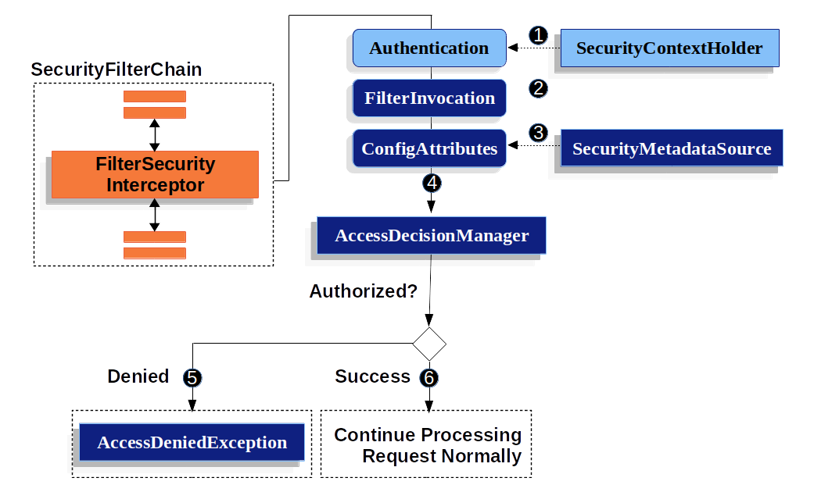

# 使用 FilterSecurityInterceptor 授权 HttpServletRequest

> FilterSecurityInterceptor 正在被 AuthorizationFilter 所取代。请考虑使用它。

本节以 Servlet 架构与实现为基础，深入探讨授权如何在基于 Servlet 的应用程序中发挥作用。

`FilterSecurityInterceptor` 为 `HttpServletRequest` 提供授权。它作为安全过滤器之一插入到过滤器链代理（`FilterChainProxy`）中。



1. 首先，`FilterSecurityInterceptor` 会从 `SecurityContextHolder` 获取一个身份验证。
2. 其次，`FilterSecurityInterceptor` 会根据传入 `FilterSecurityInterceptor` 的 `HttpServletRequest`、`HttpServletResponse` 和 `FilterChain` 创建一个 `FilterInvocation`。
3. 接下来，它会将 `FilterInvocation` 传递给 `SecurityMetadataSource` 以获取 `ConfigAttributes`。
4. 最后，它会将 `Authentication`、`FilterInvocation` 和 `ConfigAttributes` 传递给 xref:servlet/authorization.adoc#authz-access-decision-manager`AccessDecisionManager`。
    - 如果拒绝授权，就会抛出 `AccessDeniedException`。在这种情况下，`ExceptionTranslationFilter` 会处理 `AccessDeniedException`。
    - 如果允许访问，`FilterSecurityInterceptor` 会继续执行 `FilterChain`，允许应用程序正常处理。

默认情况下，Spring Security 的授权要求所有请求都经过身份验证。显式配置如下:

```java
@Bean
public SecurityFilterChain filterChain(HttpSecurity http) throws Exception {
	http
		// ...
		.authorizeRequests(authorize -> authorize
			.anyRequest().authenticated()
		);
	return http.build();
}
```

我们可以通过按优先级顺序添加更多规则来配置 Spring Security 的不同规则。

```java
@Bean
public SecurityFilterChain filterChain(HttpSecurity http) throws Exception {
	http
		// ...
		.authorizeRequests(authorize -> authorize                                  
			.mvcMatchers("/resources/**", "/signup", "/about").permitAll()         
			.mvcMatchers("/admin/**").hasRole("ADMIN")                             
			.mvcMatchers("/db/**").access("hasRole('ADMIN') and hasRole('DBA')")   
			.anyRequest().denyAll()                                                
		);
	return http.build();
}
```

1. 指定了多个授权规则。每条规则都按照声明的顺序进行审议。
2. 我们指定了任何用户都能访问的多种 URL 模式。具体来说，如果 URL 以"/resources/"开头、等于"/signup "或等于"/about"，任何用户都可以访问请求。
3. 任何以"/admin/"开头的 URL 都将仅限于拥有 "ROLE_ADMIN "角色的用户访问。你会发现，由于我们调用的是 hasRole 方法，所以不需要指定 "ROLE_"前缀。
4. 任何以"/db/"开头的 URL 都要求用户同时拥有 "ROLE_ADMIN "和 "ROLE_DBA"。您会注意到，由于我们使用的是 hasRole 表达式，因此无需指定 "ROLE_"前缀。
5. 任何尚未匹配的 URL 都会被拒绝访问。如果不想意外忘记更新授权规则，这是一个不错的策略。


