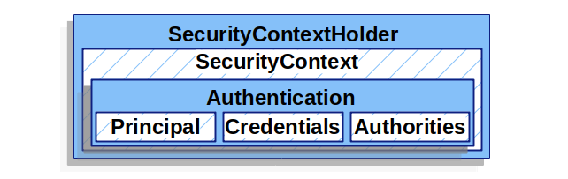
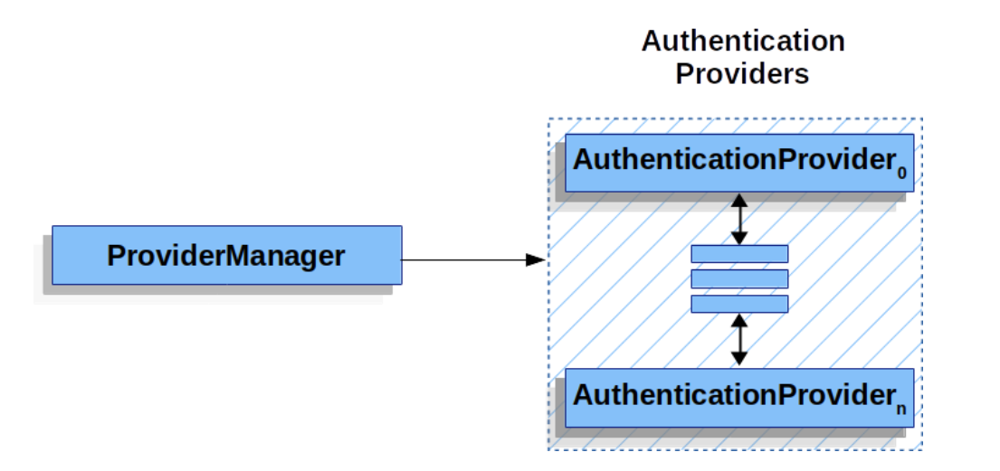
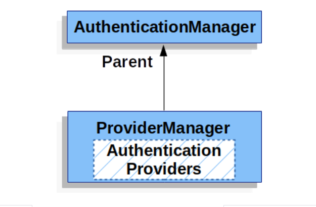
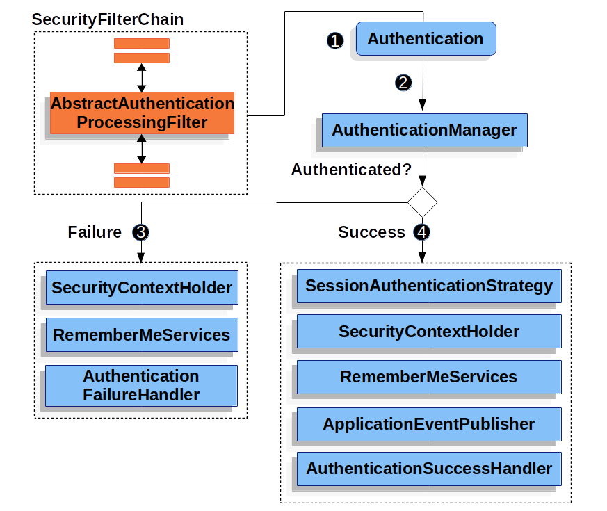

# Servlet 认证架构
本章在 Servlet 安全架构的基础上，对 Spring Security 用于 Servlet 身份验证的主要架构组件进行了阐述。

- SecurityContextHolder - SecurityContextHolder 是 Spring Security 存储身份验证详细信息的地方。
- SecurityContext - 从 SecurityContextHolder 获取，包含当前已通过身份验证用户的身份验证信息。
- Authentication - 可以是 AuthenticationManager 的输入，用于提供用户提供的认证凭据或 SecurityContext 中的当前用户。
- GrantedAuthority - 在身份验证中授予委托人的权限（如角色、作用域等）
- AuthenticationManager - 该 API 定义了 Spring Security 过滤器如何执行身份验证。
- ProviderManager - 是 AuthenticationManager 最常见的实现。
- AuthenticationProvider - 用于执行特定类型的身份验证。
- Request Credentials with AuthenticationEntryPoint - 用于从客户端请求证书（如重定向到登录页面、发送 WWW-Authenticate 响应等）。
- AbstractAuthenticationProcessingFilter - 用于身份验证的基础过滤器。这也让我们很好地了解了身份验证的高级流程以及各部分如何协同工作。

# SecurityContextHolder
Spring Security 身份验证模型的核心是 SecurityContextHolder，它包含 SecurityContext。



`SecurityContextHolder` 是 Spring Security 存储验证者详细信息的地方。
Spring Security 并不关心 `SecurityContextHolder` 的填充方式。如果它包含一个值，就会被用作当前通过身份验证的用户。

表明用户已通过身份验证的最简单方法就是直接设置 `SecurityContextHolder`。

```java
SecurityContext context = SecurityContextHolder.createEmptyContext(); 
Authentication authentication = new TestingAuthenticationToken("username", "password", "ROLE_USER"); 
context.setAuthentication(authentication);

SecurityContextHolder.setContext(context);
```

1. 我们首先创建一个空的 SecurityContext。重要的是要创建一个新的 SecurityContext 实例，
而不是使用 `SecurityContextHolder.getContext().setAuthentication(authentication)` 来避免多个线程之间的竞争条件。
2. 接下来，我们创建一个新的身份验证对象。Spring Security 并不关心在 SecurityContext 上设置了哪种类型的身份验证实现。
这里我们使用 `TestingAuthenticationToken`，因为它非常简单。更常见的生产场景是 `UsernamePasswordAuthenticationToken(userDetails、password、authorities)`。
3. 最后，我们在 `SecurityContextHolder` 上设置 SecurityContext。Spring Security 将使用此信息进行授权。

如果希望获取已验证委托人的信息，可以通过访问 `SecurityContextHolder` 来实现。


访问当前已验证的用户:
```java
SecurityContext context = SecurityContextHolder.getContext();
Authentication authentication = context.getAuthentication();
String username = authentication.getName();
Object principal = authentication.getPrincipal();
Collection<? extends GrantedAuthority> authorities = authentication.getAuthorities();
```

默认情况下，`SecurityContextHolder` 使用 `ThreadLocal` 来存储这些详细信息，这意味着同一线程中的方法始终可以使用 `SecurityContext`，
即使 `SecurityContext` 没有明确作为参数传递给这些方法。如果注意在处理完当前委托人的请求后清除线程，
那么以这种方式使用 `ThreadLocal` 是非常安全的。Spring Security 的 `FilterChainProxy` 可以确保 `SecurityContext` 始终被清除。

有些应用程序并不完全适合使用 `ThreadLocal`，因为它们处理线程的方式比较特殊。例如，Swing 客户端可能希望 Java 虚拟机中的所有线程都使用相同的安全上下文。
`SecurityContextHolder` 可以在启动时配置策略，以指定如何存储上下文。
对于独立应用程序，你可以使用 `SecurityContextHolder.MODE_GLOBAL` 策略。其他应用程序可能希望由安全线程生成的线程也采用相同的安全身份。
这可以通过使用 `SecurityContextHolder.MODE_INHERITABLETHREADLOCAL` 来实现。你可以通过两种方法改变默认的 `SecurityContextHolder.MODE_THREADLOCAL` 模式。
第一种是设置系统属性，第二种是调用 `SecurityContextHolder` 上的静态方法。大多数应用程序不需要更改默认模式，但如果需要，请查看 `SecurityContextHolder` 的 Javadoc 以了解更多信息。

# SecurityContext

SecurityContext 从 SecurityContextHolder 获取。SecurityContext 包含一个身份验证对象。

# Authentication

在 Spring Security 中，`Authentication` 有两个主要用途：
- `AuthenticationManager` 的输入，用于为用户提供进行身份验证的凭据。在这种情况下使用时，`isAuthenticated()` 返回 false。
- 代表当前已通过身份验证的用户。当前身份验证可从 `SecurityContext` 中获取。

身份验证包含:
- `principal` - 用户身份标识。使用用户名/密码进行身份验证时，这通常是 `UserDetails` 的一个实例。
- `credentials` - 通常是密码。在许多情况下，用户通过身份验证后，密码会被清除，以确保不会泄露。
- `authorities` - `GrantedAuthority` 是用户被授予的高级权限。角色或范围就是几个例子。

# GrantedAuthority
授予权限`GrantedAuthoritys`是用户被授予的高级权限。角色或作用域就是几个例子。

可通过 `Authentication.getAuthorities()` 方法获取 `GrantedAuthority`。该方法提供了一个 `GrantedAuthority` 对象集合。
不难理解，`GrantedAuthority` 是授予委托人的权限。这些权限通常是 "roles"，如 `ROLE_ADMINISTRATOR` 或 `ROLE_HR_SUPERVISOR`。
这些角色随后会被配置为网络授权、方法授权和域对象授权。Spring Security 的其他部分能够解释这些授权，并希望它们存在。
在使用基于用户名/密码的身份验证时，`GrantedAuthority` 通常由 `UserDetailsService` 加载。

通常，`GrantedAuthority` 对象是应用程序范围内的权限。它们不是特定于某个域对象的。
因此，您不可能用一个 `GrantedAuthority` 来表示 `Employee` 对象 54 的权限，因为如果有成千上万个这样的权限，内存很快就会用完（或者，至少会导致应用程序花费很长时间来验证用户）。
当然，Spring Security 是专门为处理这种常见需求而设计的，但您也可以为此使用项目的域对象安全功能。

# AuthenticationManager
`AuthenticationManager` 是定义 Spring Security 过滤器如何执行身份验证的 API。
然后，调用 `AuthenticationManager` 的控制器（即 Spring Security 筛选器）会在 `SecurityContextHolder` 上设置返回的身份验证。
如果不与 Spring Security's Filterss 集成，则可以直接设置 `SecurityContextHolder`，而无需使用 `AuthenticationManager`。

虽然 `AuthenticationManager` 的实现可以是任何东西，但最常见的实现是 `ProviderManager`。

# ProviderManager
`ProviderManager` 是 `AuthenticationManager` 最常用的实现。`ProviderManager` 委托给一个 `AuthenticationProviders` 列表。
每个 `AuthenticationProvider` 都有机会表明身份验证应该成功、失败或表明无法做出决定，并允许下游 `AuthenticationProvider` 做出决定。
如果所配置的 `AuthenticationProvider` 都无法进行身份验证，那么身份验证就会失败，并出现 `ProviderNotFoundException`（一种特殊的 `AuthenticationException`）。



实际上，每个 `AuthenticationProvider` 都知道如何执行特定类型的身份验证。
例如，一个 `AuthenticationProvider` 可以验证用户名/密码，而另一个 `AuthenticationProvider` 则可以验证 SAML 断言。
这样，每个 `AuthenticationProvider` 都可以执行非常特定类型的身份验证，同时支持多种类型的身份验证，并且只暴露一个 `AuthenticationManager` Bean。

`ProviderManager` 还允许配置一个可选的父级 `AuthenticationManager`，在没有 `AuthenticationProvider` 可以执行身份验证的情况下，
可以咨询父级 `AuthenticationManager`。父认证管理器可以是任何类型的 `AuthenticationManager`，但通常是 `ProviderManager` 的实例。



事实上，多个 `ProviderManager` 实例可能共享同一个父 `AuthenticationManager`。
这种情况在有多个 `SecurityFilterChain` 实例的情况下比较常见，这些实例有一些共同的身份验证（共享父 `AuthenticationManager`），
但也有不同的身份验证机制（不同的 `ProviderManager` 实例）。

默认情况下，`ProviderManager` 会尝试清除认证请求成功后返回的认证对象中的任何敏感凭证信息。
这样可以防止密码等信息在 `HttpSession` 中保留超过必要的时间。

这可能会在使用用户对象缓存（例如，为了提高无状态应用程序的性能）时造成问题。
如果身份验证包含对缓存中对象（如 `UserDetails` 实例）的引用，而该对象的凭据已被删除，那么将无法再根据缓存值进行身份验证。
如果使用缓存，就必须考虑到这一点。一个显而易见的解决方案是先复制一个对象，可以在缓存实现中复制，
也可以在创建返回的身份验证对象的 `AuthenticationProvider` 中复制。
或者，也可以禁用 `ProviderManager` 上的 `eraseCredentialsAfterAuthentication` 属性。

# AuthenticationProvider
可以向 `ProviderManager` 注入多个 `AuthenticationProviders`。每个 `AuthenticationProvider` 都执行特定类型的身份验证。
例如，`DaoAuthenticationProvider` 支持基于用户名/密码的身份验证，而 `JwtAuthenticationProvider` 则支持 JWT 令牌身份验证。

# 使用 `AuthenticationEntryPoint` 申请证书
`AuthenticationEntryPoint` 用于发送 HTTP 响应，请求客户端提供凭证。

有时，客户端会主动提供用户名/密码等凭证来请求资源。在这种情况下，Spring Security 不需要提供 HTTP 响应来请求客户端提供凭据，因为凭据已经包含在内了。

在其他情况下，客户端会向其无权访问的资源发出未经身份验证的请求。在这种情况下，`AuthenticationEntryPoint` 的实现将用于向客户端请求凭证。
`AuthenticationEntryPoint` 实现可能会执行重定向到登录页面、使用 WWW-Authenticate 标头等。

# AbstractAuthenticationProcessingFilter
`AbstractAuthenticationProcessingFilter` 用作验证用户凭据的基础过滤器。
在验证凭据之前，Spring Security 通常使用 `AuthenticationEntryPoint` 请求凭据。

接下来，`AbstractAuthenticationProcessingFilter` 可以对提交给它的任何身份验证请求进行身份验证。



1. 当用户提交凭据时，`AbstractAuthenticationProcessingFilter` 会从要进行身份验证的 `HttpServletRequest` 中创建一个身份验证。 
创建的身份验证类型取决于 `AbstractAuthenticationProcessingFilter` 的子类。 
例如，`UsernamePasswordAuthenticationFilter` 会根据 `HttpServletRequest` 中提交的用户名和密码创建一个 `UsernamePasswordAuthenticationToken`。
2. 接下来，身份验证信息被传入 `AuthenticationManager` 以进行身份验证。
3. 如果验证失败，则失败
    - `SecurityContextHolder` 已被清空。
    - 会调用 `RememberMeServices.loginFail`。如果没有配置 `remember me`，则不会执行此操作。
    - 调用 `AuthenticationFailureHandler`。
4. 如果验证成功，则成功
    - `SessionAuthenticationStrategy` 会收到新登录通知
    - 在 `SecurityContextHolder` 上设置身份验证。之后，`SecurityContextPersistenceFilter` 会将 `SecurityContext` 保存到 `HttpSession` 中。
    - 会调用 `RememberMeServices.loginSuccess`。如果未配置 `remember me`，则不会执行此操作。
    - `ApplicationEventPublisher` 发布交互式身份验证成功事件。
    - 调用 `AuthenticationSuccessHandler`。


