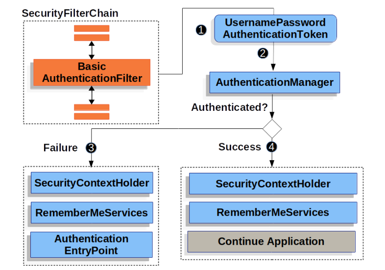
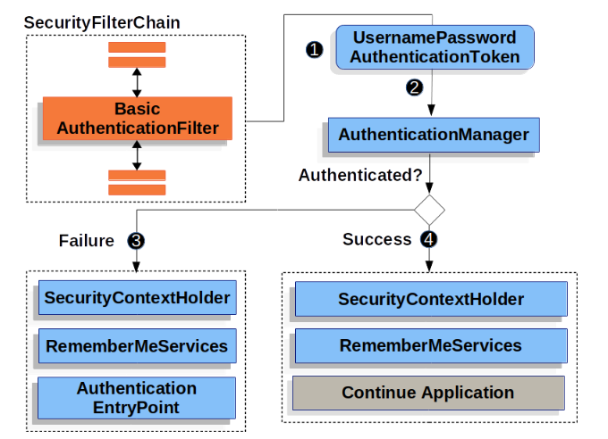

# Basic Authentication

本节将详细介绍 Spring Security 如何为基于 servlet 的应用程序提供 Basic HTTP 身份验证支持。

让我们看看 HTTP 基本身份验证在 Spring Security 中是如何工作的。首先，我们会看到 WWW-Authenticate 标头被发送回未经身份验证的客户端。



该图以我们的 `SecurityFilterChain` 图表为基础。

1. 首先，用户向未经授权的 /private 资源发出未经验证的请求。
2. Spring Security 的 `FilterSecurityInterceptor` 会抛出 `AccessDeniedException` 异常，表明未经验证的请求被拒绝。
3. 由于用户未通过身份验证，因此 `ExceptionTranslationFilter` 会启动 "开始身份验证"。
   配置的 `AuthenticationEntryPoint` 是 `BasicAuthenticationEntryPoint` 的实例，它会发送 WWW-Authenticate 标头。
   请求缓存（RequestCache）通常是一个不保存请求的 NullRequestCache，因为客户端能够重放它最初请求的请求。

当客户端收到 WWW-Authenticate 标头时，就会知道应该用用户名和密码进行重试。以下是处理用户名和密码的流程。



1. 当用户提交用户名和密码时，`BasicAuthenticationFilter` 会通过从 `HttpServletRequest` 中提取用户名和密码来创建用户名密码认证令牌 `UsernamePasswordAuthenticationToken` ，这是一种认证类型。
2. 接下来，`UsernamePasswordAuthenticationToken` 被传入 `AuthenticationManager` 进行身份验证。`AuthenticationManager` 的细节取决于用户信息的存储方式。
3. 如果验证失败，则失败:
   - SecurityContextHolder 已被清空
   - 会调用 `RememberMeServices.loginFail`。如果未配置 remember me，则不会执行此操作。
   - 调用 `AuthenticationEntryPoint` 会触发 WWW-Authenticate 再次发送。
4. 如果验证成功，则成功
   - 身份验证设置在 `SecurityContextHolder` 上。
   - 会调用 `RememberMeServices.loginSuccess`。如果未配置 remember me，则不会执行此操作。
   - `BasicAuthenticationFilter` 会调用 `FilterChain.doFilter(request,response)` 来继续执行其余的应用程序逻辑。

Spring Security 的 HTTP Basic 身份验证支持默认已启用。不过，一旦提供任何基于 servlet 的配置，就必须明确提供 HTTP Basic。

下面是最低限度的显式配置：

```java
@Bean
public SecurityFilterChain filterChain(HttpSecurity http) {
	http
		// ...
		.httpBasic(withDefaults());
	return http.build();
}
```