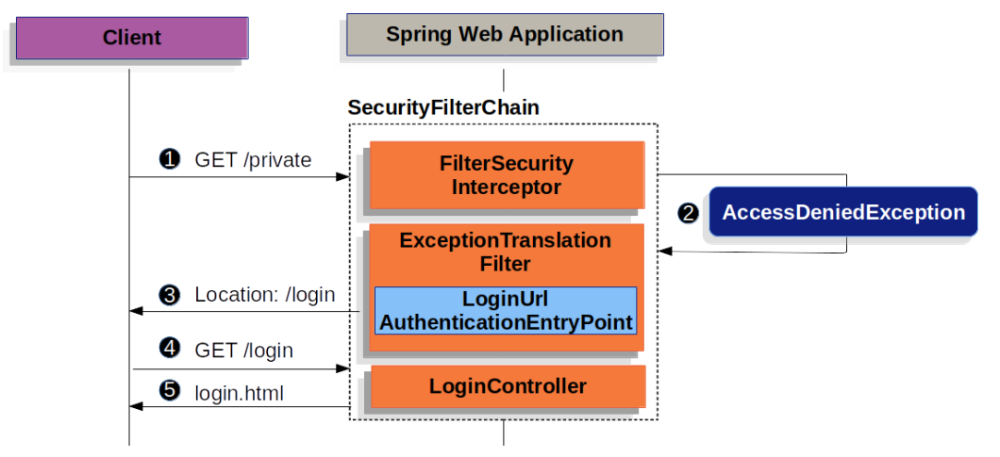
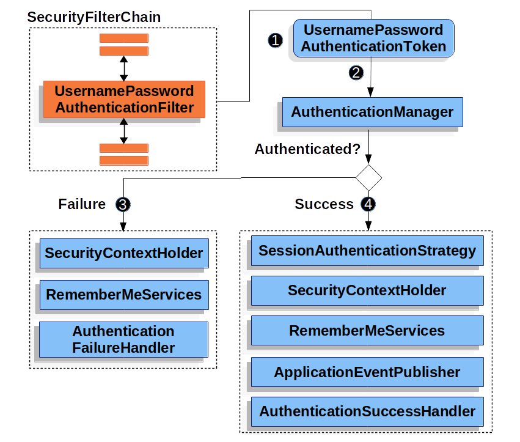

# Form Login
Spring Security 支持通过 html 表单提供用户名和密码。本节将详细介绍 Spring Security 中基于表单的身份验证是如何工作的。

让我们来看看 Spring Security 中基于表单的登录是如何工作的。首先，我们来看看用户是如何被重定向到登录表单的。



该图以我们的 `SecurityFilterChain` 图表为基础。

1. 首先，用户向未经授权的 /private 资源发出未经验证的请求。
2. Spring Security 的 `FilterSecurityInterceptor` 会抛出 `AccessDeniedException` 异常，表明未经验证的请求被拒绝。
3. 由于用户未通过身份验证，因此 `ExceptionTranslationFilter` 会启动开始身份验证，并通过配置的 `AuthenticationEntryPoint` 发送重定向到登录页面。
在大多数情况下，`AuthenticationEntryPoint` 是 `LoginUrlAuthenticationEntryPoint` 的实例。
4. 然后，浏览器会请求重定向到的登录页面。
5. 应用程序中的某些内容必须呈现登录页面。

提交用户名和密码后，用户名和密码验证过滤器 `UsernamePasswordAuthenticationFilter` 将对用户名和密码进行验证。
用户名密码身份验证过滤器扩展了抽象身份验证处理过滤器 `AbstractAuthenticationProcessingFilter` ，因此该图看起来应该非常相似。



1. 当用户提交用户名和密码时，`UsernamePasswordAuthenticationFilter` 会通过从 HttpServletRequest 中提取用户名和密码来创建一个用户名密码验证令牌 `UsernamePasswordAuthenticationToken` ，这是一种验证类型。
2. 接下来，`UsernamePasswordAuthenticationToken` 被传入 `AuthenticationManager` 进行身份验证。`AuthenticationManager` 的细节取决于用户信息的存储方式。
3. 如果验证失败，则失败:
    - `SessionAuthenticationStrategy` 会收到新登录通知。
    - `Authentication` 设置在 `SecurityContextHolder` 上。
    - 会调用 `RememberMeServices.loginSuccess`。如果未配置 `remember me`，则不会执行此操作。
    - `ApplicationEventPublisher` 发布 `InteractiveAuthenticationSuccessEvent`。
    - 调用 `AuthenticationSuccessHandler`。通常情况下，这是一个 `SimpleUrlAuthenticationSuccessHandler`，当我们重定向到登录页面时，
      它会重定向到 `ExceptionTranslationFilter` 保存的请求。

Spring Security 默认启用表单登录。不过，一旦提供了基于 servlet 的配置，就必须明确提供基于表单的登录。下面是一个最低限度的显式 Java 配置：

```java
public SecurityFilterChain filterChain(HttpSecurity http) {
	http
		.formLogin(withDefaults());
	// ...
}
```

在此配置中，Spring Security 将呈现默认登录页面。大多数生产应用程序都需要自定义登录表单。

下面的配置演示了如何提供自定义登录表单。

```java
public SecurityFilterChain filterChain(HttpSecurity http) {
	http
		.formLogin(form -> form
			.loginPage("/login")
			.permitAll()
		);
	// ...
}
```

在 Spring Security 配置中指定登录页面时，你需要负责渲染该页面。下面是一个 Thymeleaf 模板，可生成符合 /login 登录页面的 HTML 登录表单：

```html
<!DOCTYPE html>
<html xmlns="http://www.w3.org/1999/xhtml" xmlns:th="https://www.thymeleaf.org">
	<head>
		<title>Please Log In</title>
	</head>
	<body>
		<h1>Please Log In</h1>
		<div th:if="${param.error}">
			Invalid username and password.</div>
		<div th:if="${param.logout}">
			You have been logged out.</div>
		<form th:action="@{/login}" method="post">
			<div>
			<input type="text" name="username" placeholder="Username"/>
			</div>
			<div>
			<input type="password" name="password" placeholder="Password"/>
			</div>
			<input type="submit" value="Log in" />
		</form>
	</body>
</html>
```

默认 HTML 表单有几个要点：
- 表单应向 /login 发送信息
- 表单需要包含 `CSRF Token`，Thymeleaf 会自动包含该令牌。
- 表单应在名为 `username` 的参数中指定用户名
- 表单应在名为 `password` 的参数中指定密码
- 如果发现 HTTP 参数错误，则表明用户未能提供有效的用户名/密码
- 如果找到 HTTP 参数 logout，则表示用户已成功注销

许多用户只需自定义登录页面即可。不过，如果需要，上述所有内容都可以通过额外配置进行自定义。

如果使用 Spring MVC，则需要一个控制器，将 `GET /login` 映射到我们创建的登录模板。下面是一个最小的 `LoginController` 示例：

```java
@Controller
class LoginController {
	@GetMapping("/login")
	String login() {
		return "login";
	}
}
```


